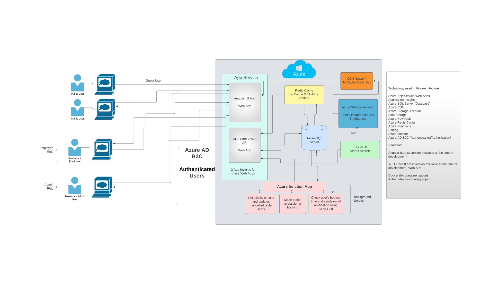

# Getting Satrted with "Restaurant Table Booking App - Full Development Series"

[Application Demo](https://lsc-table-booking-app-api.azurewebsites.net/swagger/index.html)

# Restaurant Table Booking App

## Project Overview
Welcome to the "Restaurant Table Booking App - Full Development Series"! This project is a comprehensive video series that takes you through the step-by-step process of building the ultimate table booking application for restaurants. Whether you're a developer looking to expand your skills or an aspiring entrepreneur with a brilliant idea, this series has something exciting for you.

In this journey, we will cover a wide range of topics, including frontend and backend development, Azure cloud services, user authentication, email notifications, background processes, and much more. Our goal is to provide you with a well-rounded understanding of building a powerful, scalable, and user-friendly restaurant app.

## Getting Started
To get started with this project, make sure you have the following prerequisites installed on your machine:

Angular 16 or later
.NET Core 7 or later
Docker and Kubernetes (optional for scaling)
Clone the project repository to your local machine and follow the instructions in each video to build the application step-by-step.

### Restaurant Table Booking App  | 
### Part 1: Architectural Overview and Tech Stack

In Part 1 of the series, we dive into the foundational aspects of our application. We'll explore the architectural overview of the app and discuss the tech stack we'll be using throughout the development process.

You'll gain insights into frontend development with Angular, backend development with .NET Core Web API, and the powerful capabilities of Azure services such as App Service, SQL Server, CDN, and more.

Whether you're a frontend enthusiast, backend ninja, or cloud aficionado, this video sets the stage for the exciting journey ahead.

Stay tuned for the next parts of the series, where we'll start building the app, implementing features, and transforming the idea into a reality!

### Let's Get Started!
Now that you have a glimpse of what's in store, let's dive in and begin our quest to build the ultimate restaurant table booking app. Follow along with each video as we explore, learn, and create an app that will leave a lasting impact on the restaurant industry.

### Part 2: Database Design and Setup

In Part 2 of our "Restaurant Table Booking App" series, we delve into the essential process of database design and setup. Building on the architectural overview from Part 1, we focus on creating the necessary tables to manage restaurants, branches, dining tables, time slots, users, and reservations.

### Database Schema Overview:

- **Restaurants Table**: Stores information about different restaurants.
- **RestaurantBranches Table**: Represents branches for each restaurant, linked via foreign key.
- **DiningTables Table**: Defines individual dining tables within each branch.
- **TimeSlots Table**: Records available time slots for table bookings at each branch.
- **Users Table**: Holds user details, including registered customers and staff.
- **Reservations Table**: Keeps track of table reservations made by users, linked to specific tables and time slots.

Our thoughtfully designed database schema enables efficient data management and lays the groundwork for seamless table booking operations in our application.

Stay tuned for Part 3, where we'll dive into setting up the Azure SQL Setup & DB Initialization.

### Part 3:  Azure SQL Setup & DB Initialization

In Part 3 of our series, we dive into setting up Azure SQL Server and Database for our Restaurant Table Booking App. Learn how to configure client IP access, and run the database script to create tables and populate sample data, laying the foundation for our app's functionality. Join us for this essential step in building our restaurant application!

### Part 4: Setting Up .NET Core Web API and Entity Framework Core

In Part 4 of our series, we take our Restaurant Table Booking App to the next level by setting up the backend infrastructure. We create a .NET Core 7 Web API project named "LSC.RestaurantTableBookingApp.API" and establish three additional projects - "LSC.RestaurantTableBookingApp.Core," "LSC.RestaurantTableBookingApp.Data," and "LSC.RestaurantTableBookingApp.Service."

Next, we install essential Entity Framework packages and configure the connection string in appsettings to connect to Azure SQL Database, which we provisioned in Part 2. We then dive into configuring the DbContext and utilize the powerful "dotnet ef dbcontext scaffold" command to generate models based on the database structure.

Join us as we lay the foundation for seamless data management and backend functionality for our restaurant app!

### Part 5: Database Migrations & Table Enhancements

Welcome to Part 5 of the Restaurant Table Booking App series! In this episode, 
we'll delve into the exciting world of database management as we explore database migrations and 
table enhancements. Join us as we learn how to modify the relationships between dining tables and time slots to streamline our app's functionality and user experience. Additionally, we'll add new columns to the User table and rename certain columns in other tables to better align with our evolving needs. Whether you're a seasoned developer or just starting out, this step-by-step tutorial will equip you with the knowledge and skills to confidently manage and optimize your database for a seamless dining reservation experience. Get ready to level up your app and take it to new heights with these essential database techniques! Don't miss out - tune in now and let's dive into the world of database migrations and table enhancements.

### Part 6: Building Restaurant Controller & Retrieving Data Endpoints
In this exciting installment of our Restaurant Table Booking App series, we will dive into creating the Restaurant Controller and implementing four essential GET endpoints. These endpoints will empower users to retrieve critical information about restaurants, branches, and available dining tables with their corresponding timeslots, all tailored by branch. Join us as we build the foundation for an efficient and user-friendly booking system.

### Part 7: Deploying and Hosting on Azure Web App
In Part 7 of the Restaurant Table Booking App series, we will take the next step in our journey and learn how to deploy and host our Web API on Azure Web App. Watch as we create a Web App in the Azure portal and demonstrate how to manually deploy it using the publish option from Visual Studio. We'll also explore how to configure the connection string under the configuration settings in Azure Web App. Join us for this hands-on tutorial and see how our app comes to life as we showcase a working demo from the hosted URL.

### Part 8: Configure Serilog & Application Insights in Azure
In Part 8 of the Restaurant Table Booking series, we delve into the world of logging and monitoring. Learn how to configure Serilog and leverage Application Insights in Azure to gain valuable insights into your Web API's performance and track exceptions effectively. Witness the power of logging as we explore request and response middleware, and see how it all comes together to enhance your application's visibility.

### Part 9: Automating Timeslot Generation with Azure Timer Function
In Part 9 of the Restaurant Table Booking App series, we dive into the world of automation with Azure Timer Functions. Learn how to create a Timer Function that runs daily at 6 AM, checking the Timeslot table to determine the last reservation date for each restaurant branch. Discover how to dynamically insert available dining table slots into the Timeslots table, ensuring the slots are available for reservation up to two days in advance. Join us in this tutorial to streamline the process of generating timeslots and enhance the efficiency of your restaurant table booking system.

### Part 10: Provision Azure Function in Portal & deploy from visual studio
In Part 10 of the Restaurant Table Booking series, we explore the process of provisioning an Azure Function in the Azure Portal and deploying it from Visual Studio. Follow along as we demonstrate the step-by-step setup of an Azure Function App using the Azure Portal. Then, learn how to deploy your function code from Visual Studio to the newly provisioned Function App. With this knowledge, you can efficiently manage and deploy your Azure Functions for your restaurant table booking application.

### Part 11: Automating CI/CD with Azure Deployment Center in GitHub Actions
In Part 11 of the Restaurant Table Booking App series, we will explore how to automate Continuous 
Integration and Continuous Deployment (CI/CD) using the Azure Deployment Center within GitHub Actions.
Learn how to set up a seamless CI/CD pipeline for your application, allowing for automatic deployments
based on code changes. Improve your development workflow and streamline the deployment process with 
this powerful integration.

### Part 12: Restaurant Table Booking App - coding overview - Part 12 Angular 16 - Restaurant Selection, Slot Booking & User Info
Get started with Angular. Learn some fundamental of angular app and start with home page, create pages that supports selection of Restaurant and it's branch. Populate the available dates for booking, allow selection of 
a timeslot/table.

### Part 13:Restaurant Table Booking App | Part 13: User Check-In Process and Reservation Status Update
In this 13th installment of our video series, we're enhancing our restaurant table booking application. We've modified our existing model to include user email information for dining table bookings. Now, in our Angular UI, this user email information is used to enable a "Check-In" button, typically used by restaurant employees. However, since AD B2C integration is pending, regular users can also perform check-ins.

When a user clicks the "Check-In" button, we send this information to a new endpoint in our Web API. This endpoint then updates the status of the timeslot and reservation tables, reflecting the check-in process. Join us as we explore this crucial feature that enhances the functionality and usability of our application

### Part 13: 
Create Web App for Angular and deploy the package manually to web site to test it out.

### Part 14:
Setup CI/CD for Angular project and get it auto deployed to web app in azure.

### Part 15:
API: Create end points that supports reservation of dining table

### Part 16: 
Angular: Implement UI for reservation

### To initiate code check in to repo
To add your code from your local repository to the remote repository on Azure DevOps, you can follow these steps:

Initialize Git Repository: If you haven't already done so, initialize a Git repository in your local project directory by running the following command in the root of your project:

git init

Add and Commit Changes: Add all your project files to the Git repository and make an initial commit:

git add .
git commit -m "Initial commit"

Add Remote Repository: Add the Azure DevOps remote repository as a remote named "origin":

git remote add origin https://learnsmartcoding@dev.azure.com/learnsmartcoding/tutorials/_git/RestaurantTableBookingApp.API

Push Code to Remote Repository: Push your code to the Azure DevOps remote repository on the "main" branch (or any other branch you prefer):

git push -u origin main

If it's the first time pushing to this repository, you may be prompted to enter your Azure DevOps credentials.
